# SKILLIFY | Training Center

Secured web application that provides online courses through a multi-role platform for instructors, users, and admins.

## 📌 Overview

SKILLIFY is an online learning platform where instructors can publish and manage courses, users can explore and purchase courses, and admins can review instructor applications before granting publishing access.

## 🚀 Key Features

- Secure authentication using JSON Web Tokens (JWT)
- Role-based authorization for Admin, Instructor, and User
- Instructor application review workflow
- Course creation, editing, and content management
- Browse, favourite, and purchase courses
- Shopping cart and checkout flow
- User profile management
- Logging system for monitoring user and system actions
- Protection against common vulnerabilities such as XSS, CSRF, and injection attacks

## 🔐 Security

### Authentication
- JWT-based authentication is used to secure user sessions and protected routes.

### Authorization
- Role-Based Access Control (RBAC) ensures each role can only access the features assigned to it.

### Penetration Testing
- The application was tested against common web vulnerabilities.
- Security mitigations were applied to strengthen the system and reduce attack risks.

## 🧑‍🏫 Instructor Panel

Instructors can register and log in to their accounts, create and manage courses, upload learning materials, edit course details, and organize course sessions through a dedicated dashboard.

## 👨‍🎓 User Panel

Users can create accounts, explore all available courses published by instructors, view course details, add courses to favourites or cart, complete purchases, access enrolled courses, and manage their personal profile.

## 🛡️ Admin Panel

Admins are responsible for reviewing instructor applications and deciding whether submitted instructors should be accepted or rejected before accessing the platform as course publishers.

## 🛠️ Built With

- React
- Node.js
- Express
- MongoDB

## 👥 Roles

- **Instructor**: Creates, edits, and manages courses and course content  
- **User**: Browses, favourites, purchases, and accesses enrolled courses  
- **Admin**: Reviews instructor submissions and controls approval workflow  

## 📸 Screenshots

### Landing Page

### Admin Dashboard
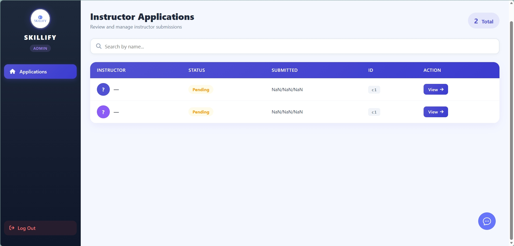

### Instructor Dashboard

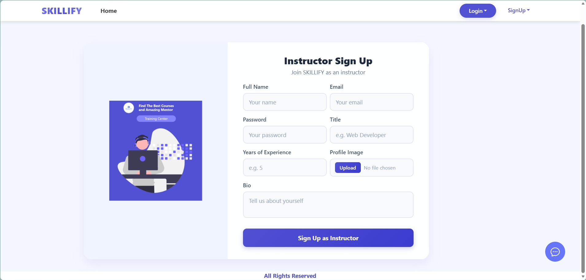

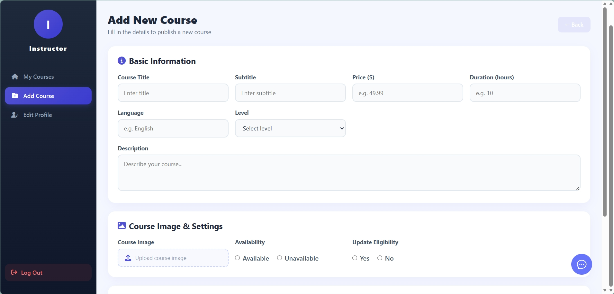

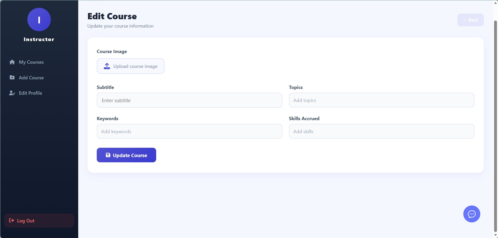
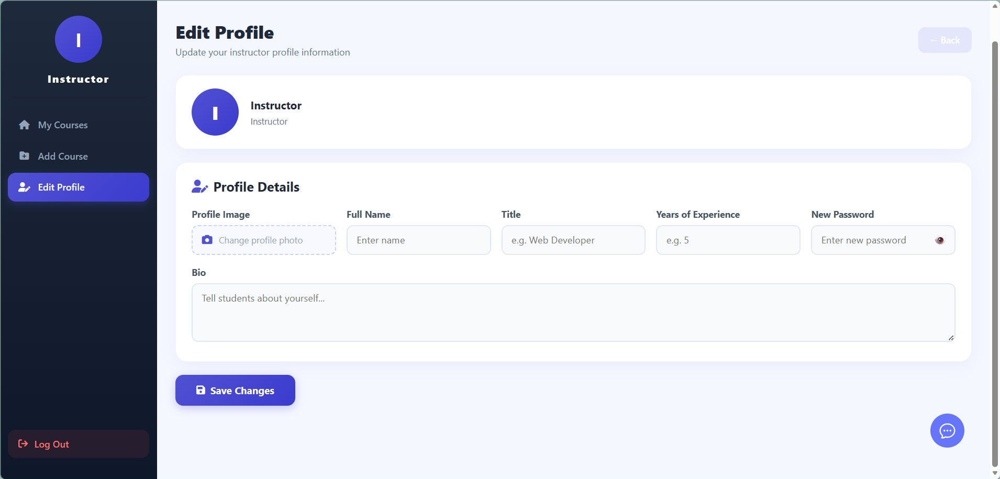

### User Panel
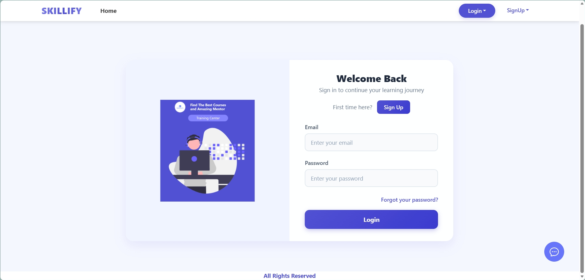
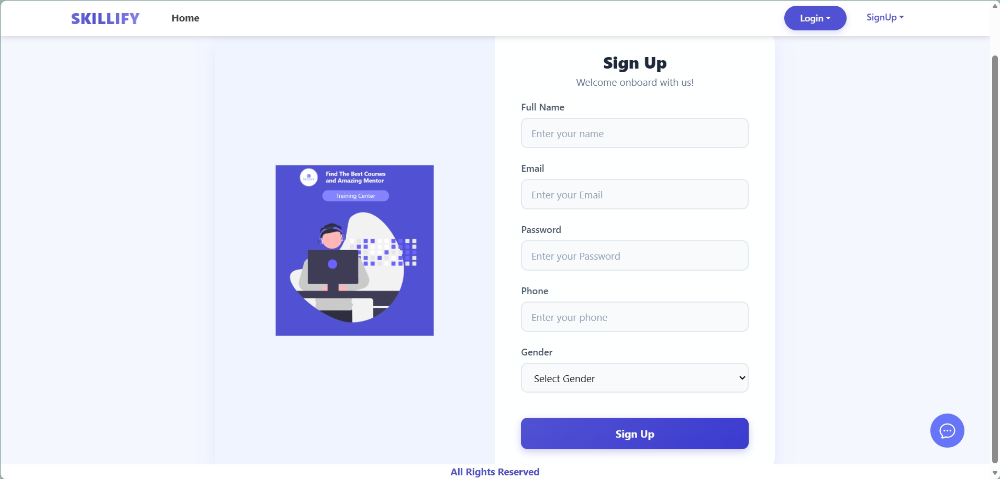
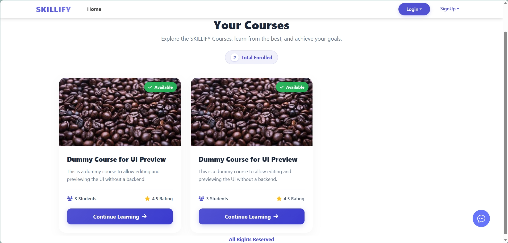
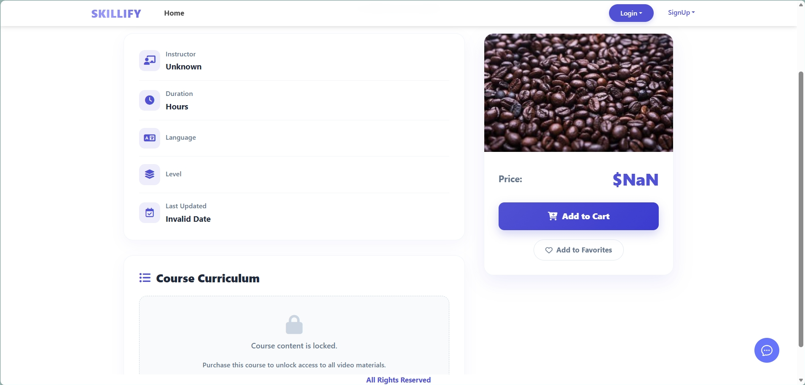
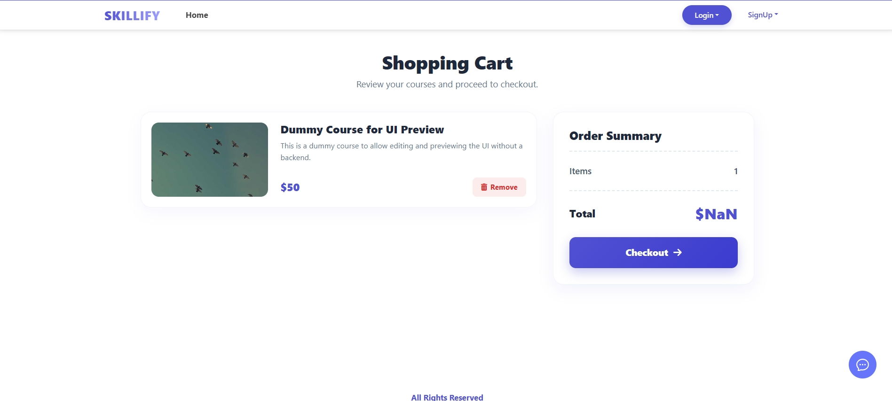
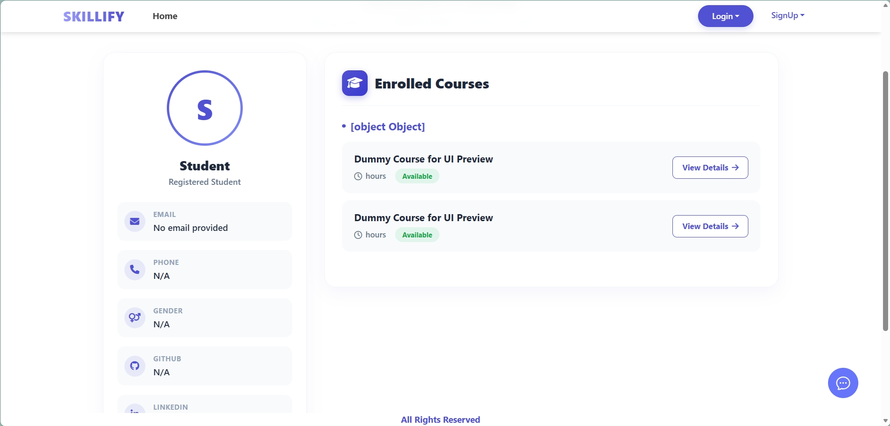
